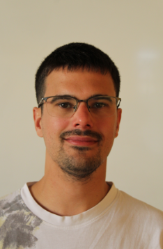

# Currículum Vitae

## Luis Sánchez Martín

## Habilidades técnicas

* **Lenguajes de programación:** JAVA, JavaScript, PHP
* **Tecnologías web:** HTML, CSS, JQUERY, JSON, node.js, LARAVEL
* **Bases de datos:** MYSQL, MONGO DB
* **Herramientas:** figma.com (diseño web), GITHUB, Docker, Apache
* **Sistemas operativos:** Ubuntu, Windows Server

---
### Información de contacto

* **Correo electrónico:** [luis010993@gmail.com](mailto:luis010993@gmail.com)
* **Teléfono:** +34 680 611 347
* **GitHub:** [github.com/lsanchez010993](https://github.com/lsanchez010993)
* **Dirección:** C/ Passatge del pi, nº2 – 17300 Blanes

---

## Sobre mi

La lectura y la escritura son, y lo han sido siempre, dos pilares fundamentales de mi vida. He dedicado años a hacer ambas cosas. Cualquiera que sepa de la ardua tarea de escribir sabe que para hacerlo con corrección y precisión es necesario dedicar tiempo y paciencia, y que un buen relato debe pasar por muchos borradores antes de estar pulido. Lo mismo sucede con los programas, escritos en cualquier lenguaje de programación.

En los años que he cursado DAW he observado los paralelismos que tiene la escritura con la programación: constancia (para desarrollar el código) y dedicación (para refactorizarlo). Ambos atributos son imprescindibles para hilar un codigo claro y conciso. La creatividad es una de mis mayores virtudes.

---

## Programas desarrollados en Java

- **Programa de encriptación con interfaz gráfica:**  
  [Encriptar Archivos](https://github.com/lsanchez010993/EncriptarArchivos)

- **Programa múltiples juegos por consola:**  
  [MultiJuegos](https://github.com/lsanchez010993/MultiJuegos)

- **Formar palabras:**  
  [Programa Aprendizaje](https://github.com/lsanchez010993/ProgramaAprendizaje)

- **Buscaminas:**  
  [Minas 2024](https://github.com/lsanchez010993/minas2024/)

---

## Experiencia laboral

* **2022-2024:** Hotel Guitart Park (Lloret de Mar)
* **2021:** Camping Resort Els Pins (Malgrat de Mar)
* **2018-2020:** Piscina Municipal (Lloret de Mar)
* **2018:** Olympic Sport Club (535 horas)
* **2017:** Cadena de hoteles Aqua Hotel: Silhouette, Aquamarina, Onabrava, Montagut (800 horas)
* **2015:** Hotel Rosamar Garden (315 horas)
* **2014:** Water World Lloret (675 horas)
* **2014:** Prácticas de empresa (CFGM) Evenia Olympic Garden (115 horas) -Vigilancia de piscinas
* **2013:** Prácticas de empresa (CFGM) Colegio Mossén Joan Batlle (364 horas) -Mantenimiento y puesta a punto de equipos informaticos (formateos, copias de seguridad)

Como puntos fuertes puedo destacar la atención al cliente y el trabajo en equipo.

---

## Historial académico

* **2022-2026:** CFGS — Desarrollo de Aplicaciones Web

  * Desarrollo de aplicaciones web dinámicas, programación en JavaScript, PHP, uso de frameworks (como Laravel), gestión de bases de datos SQL y NoSQL, despliegue en servidores.
* **2016-2017:** Curso de Acceso al Grado Superior

  * Preparación académica en matemáticas, lengua y tecnología para el acceso a ciclos superiores.
* **2013-2014:** CFGM — Salvamento y Socorrismo Acuático

  *Técnicas de socorrismo, primeros auxilios, gestión de emergencias acuáticas.
* **2010-2013:** CFGM — Sistemas Microinformáticos en Red

  * Configuración de redes, administración de sistemas operativos, mantenimiento de equipos informáticos.

---

## Cualidades personales

* Paciente
* Constante
* Puntual
* Comprometido
* Responsable

---

## Datos de interés

* Disponibilidad inmediata y flexibilidad horaria
* Permiso de conducir B
* Vehículo propio
